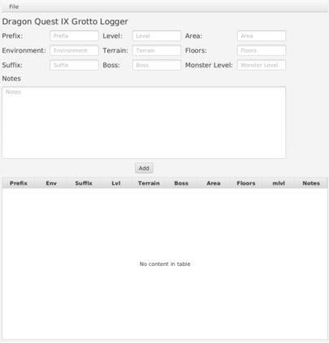

# Dragon Quest IX Grotto Logger
Dragon Quest IX Grotto Logger is an application used for recording information on grottoes in the Nintendo DS game, Dragon Quest IX. It allows lists of grottoes to be exported / saved and imported as `.csv` files.

It is based off of the [Dragon Quest IX Grotto Log App](http://www.woodus.com/den/games/dq9ds/grottolog.php) created by [Cain](http://www.woodus.com/forums/index.php?showuser=2277), but is completely rewritten, and uses none of the original's source code.

## License
The source code of Dragon Quest IX Grotto Logger is available under the [MIT License](https://opensource.org/licenses/MIT), see `LICENSE` for more information.
